# Relay

**Run all your Claude and Codex sessions from one VS Code tab.** See which session needs you, answer it in a click, and keep an eye on your plan limits without leaving the editor.

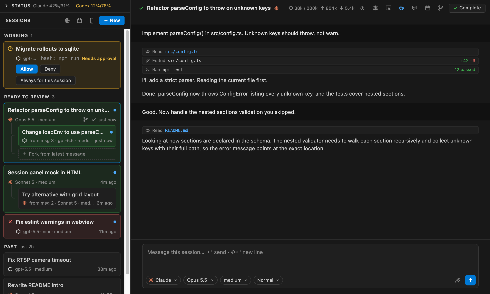

Relay drives the `claude` and `codex` CLIs you already have, so your logins, settings, `CLAUDE.md` files and permission rules all still apply.

## Get started

1. Install it (needs [Claude Code](https://docs.claude.com/en/docs/claude-code) and/or [Codex](https://github.com/openai/codex), signed in):
   ```
   make install && make install-extension
   ```
2. Press **⌘P**, type **`> relay editor`** and pick **Relay: Open as Editor Tab**.

   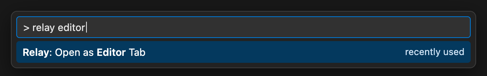 relay editor' typed and Relay: Open as Editor Tab selected">

   Relay opens as a tab with two columns. Prefer it narrow? Click the Relay icon in the activity bar to use it in the sidebar.
3. Type what you want done and press **↵**.

## Features

### Claude and Codex, side by side

Pick the agent, model and effort for each message. The model list comes straight from each CLI, so new models show up as soon as your CLI has them. Set the mode to **Plan** to have the agent ask its questions before it writes any code, or **Ask** to get an answer without anything being changed.

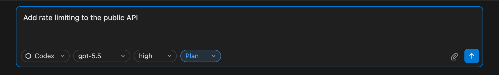

### Sessions sorted by what needs you

Sessions sit in three groups, so the one that needs you is always at the top:

- **Working**: running, or waiting for your approval (amber).
- **Ready to review**: finished since you last looked.
- **Past**: seen in the last 2 hours. **Show all past sessions** finds the rest.

Forks and subsessions nest under the session they came from. Every session gets a short title that follows the conversation.

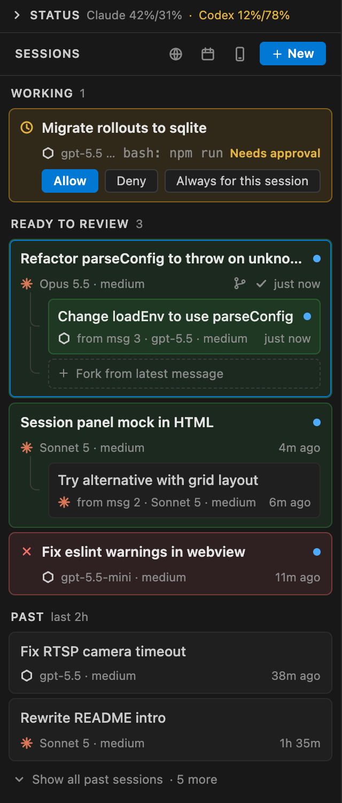

### Unread until you've looked

A session that finishes or fails while you're elsewhere gets a **blue dot** and moves to **Ready to review**. Opening it clears the dot, and it moves to **Past** once you click away. While you're elsewhere, the activity bar badge counts what's waiting, and a notification (with a sound if VS Code isn't in front) tells you when a session finishes, fails or needs you.

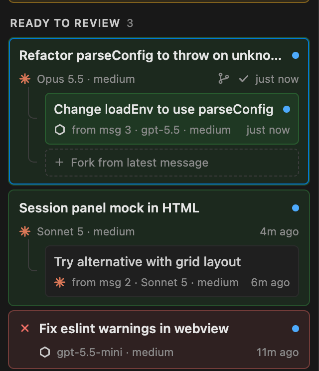

### Complete when you're done

**Complete** (top right of the chat, or the check on a card) archives a session and takes it off your list. Send it another message and it comes back. The header also shows how full the context window is, the token counts, a run timer, and a row of switches:

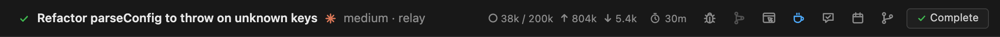

- **⏱ Time limit**: click the timer to set one, such as `30m`; the agent stops when it runs out.
- **Fork** (the last icon): branch the session off from its latest message. Hover any earlier message to fork from there instead.
- **Inspector**, **worktree**, **browser access**, **keep awake**, **second opinion** and **schedule**: each one is covered below.

### Approvals right where you are

When an agent wants to run something that needs a person, Allow / Deny shows up on its card in the list and in the chat. File changes show their diff. Both agents run in their **auto** mode, so this only happens for the things that need you.

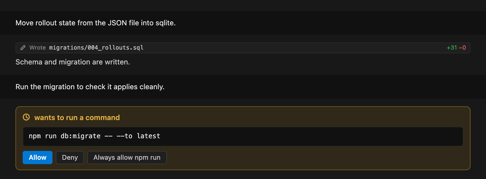

### Questions as buttons

When an agent asks multiple-choice questions, you get a button for each option. Pick one, or type your own answer.

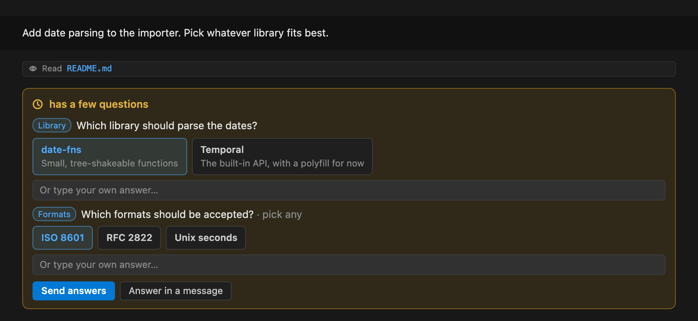

### Queue, interrupt, stop

Keep typing while the agent works. **↵** queues the message for when the turn ends, **⌘↵** interrupts and sends it now, **Esc** stops the agent. Queued messages wait above the box, each with **send now** and **remove**.

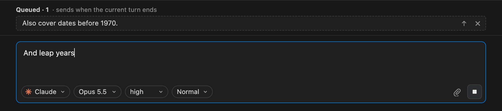

### @ for files

Type **@** and start typing to fuzzy-search the project's files. Spaces are fine, so `comp ts` finds `src/webview/composer.ts`. **↵** or **Tab** puts the file's relative path in the message, and **Esc** closes the search. Files ignored by git are included. Dependency and cache folders such as `node_modules` and virtualenvs are left out.

### Plan limits at a glance

**Status** shows every limit Claude and Codex report: the 5-hour session, weekly limits, per-model limits, extra usage and credits, each with time until reset. Bars turn amber at 75% and red at 90%.

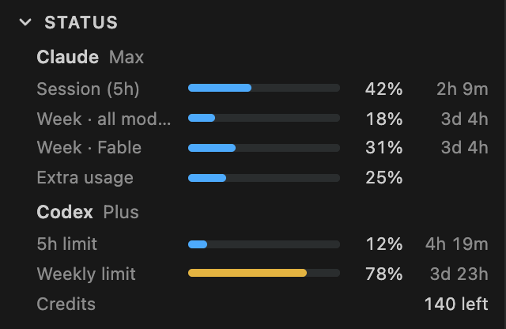

### Second opinion

The speech-bubble button opens a subsession with the *other* agent and drafts a review request for you: what was asked, what the agent said, which files changed, and where to find the diff. Edit it if you like, then send.

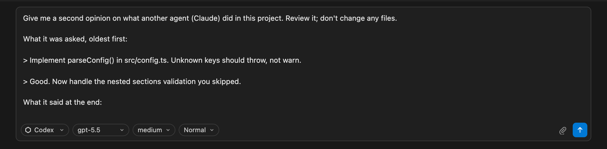

### Inspector

The bug icon shows what a Claude session loaded and how it ran: model and version, cost, what's filling the context window, CLAUDE.md and other memory files, every file touched and tool call with its timing, and events such as retries, failed hooks and compactions.

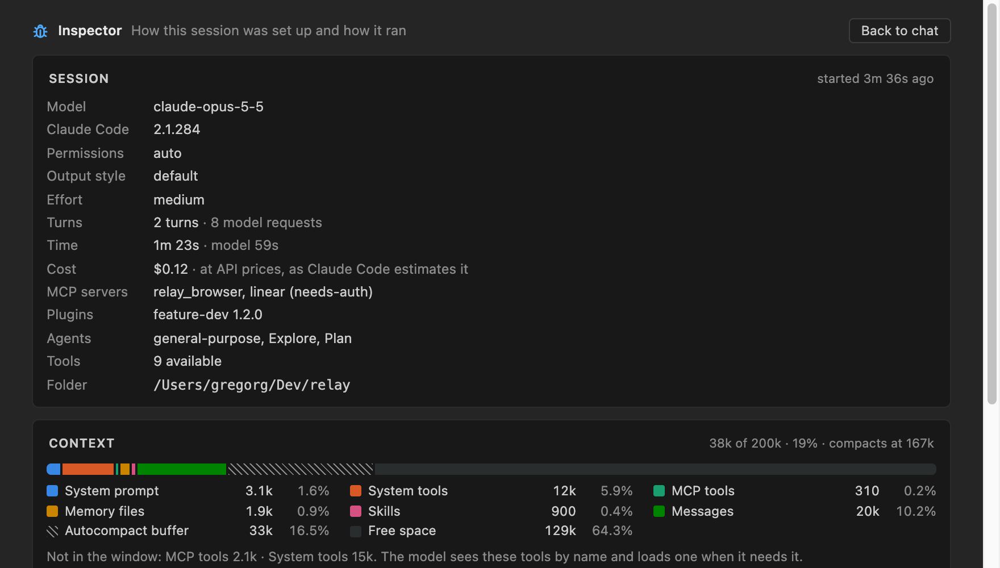

### Notes from the browser

Click the globe to open your app in Relay's own Chrome window. Press ✎ (or ⌥⇧C), click an element and say what should change. The note goes to the chat with the element's selector, a screenshot, and any console errors and failed requests. Turn on **browser access** in a chat and the agent can drive that same window to check its own work.

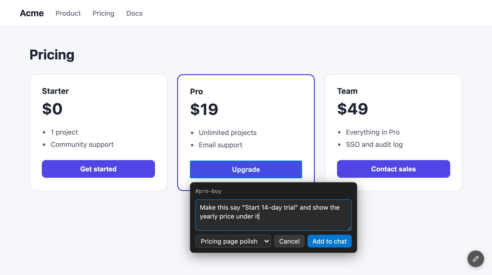

### Scheduled tasks

The calendar turns a prompt into a session that runs daily, on weekdays, weekly or monthly, each run in its own git worktree. **Save and run now** lets you try it first. Tasks only run while the project is open in VS Code; a run that was missed starts once when you're back.

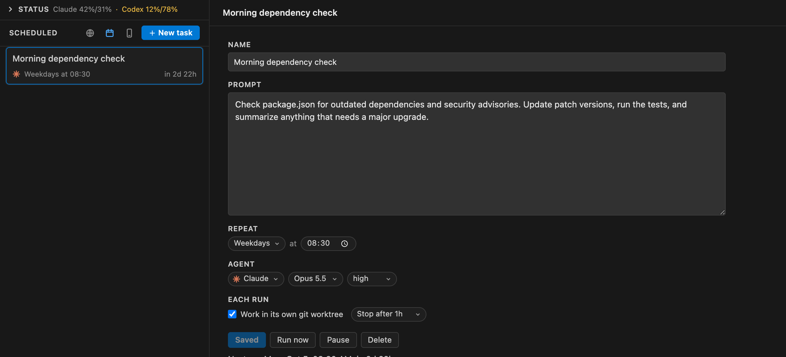

### From your phone

The phone icon shows a QR code. Scan it to check sessions, answer approvals, send prompts and stop agents from anywhere. The connection goes over your private [Tailscale](https://tailscale.com) network, so nothing is open to the internet. Remote access turns itself off after 24 hours, or when you're back at the Mac.

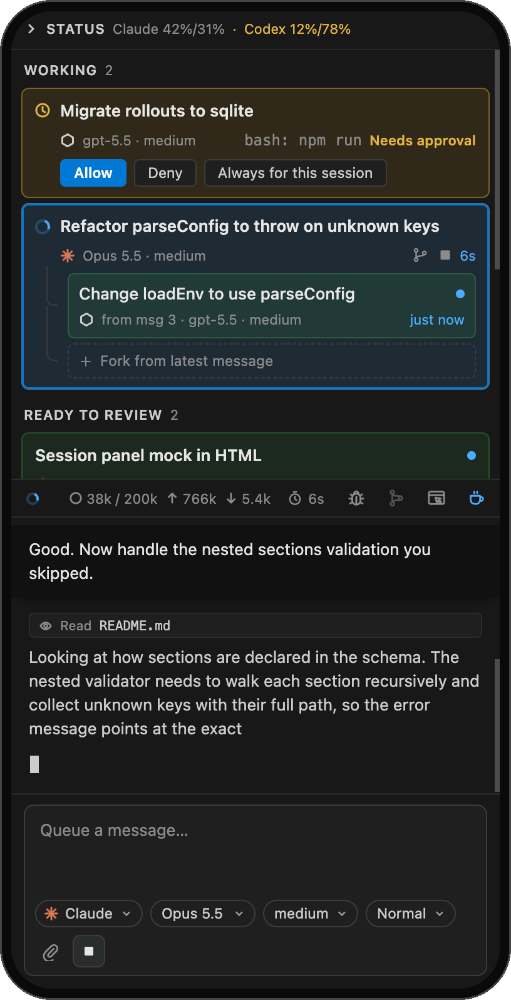

### Long runs

- **Keep awake**: your Mac won't idle-sleep while an agent works.
- **Worktrees**: click the branch icon before the first message and the session works on its own `relay/…` branch in `~/.relay/worktrees`, leaving your project folder alone. **Complete** merges it back.
- **Sessions are saved** in `.relay/sessions/` in your project, so they survive reloads. They hold full transcripts, so consider adding `.relay/` to `.gitignore`.

## Requirements

- VS Code 1.137 or newer. Keep awake, sound notifications and remote access are macOS-only.
- Claude Code and/or Codex, installed and signed in. Plan limits need a subscription sign-in (claude.ai, ChatGPT); with an API key, everything else still works.
- Optional: Google Chrome (or another Chromium browser) for browser notes, Node.js for browser access, and Tailscale on the Mac and phone for remote access.

## Settings

| Setting | Default | |
|---|---|---|
| `relay.notifications` | `all` | `all`, `inApp` (VS Code only) or `off` (badge only). |
| `relay.keepAwake` | `true` | Keep the Mac awake while an agent works. |
| `relay.titleModel` | `gpt-5.6-luna` | Codex model that writes session titles. |
| `relay.planPrompt`, `relay.askPrompt` | | Instruction added to messages sent in Plan or Ask mode. |
| `relay.claudePath`, `relay.codexPath`, `relay.chromePath`, `relay.tailscalePath` | | Where to find each tool, if Relay can't find it on its own. |
| `relay.backend` | `real` | `mock` runs fake agents with sample sessions, for working on the UI. |

## Known limitations

- Clicking the macOS notification opens Script Editor, not VS Code. Use the **Open** button in VS Code's notification.
- Only sessions started from Relay are listed, not ones you start with `claude` or `codex` in a terminal.

## Development

```
make install   # once
make run       # build, then open an Extension Development Host on this folder
make watch     # rebuild on change; reload the dev host window with ⌘R
make package   # build relay.vsix without installing it
```

Set `relay.backend` to `mock` to work on the UI without using up your plan.

- **Session rules** (unread, complete, queue, forks, time limits) live in [RealSessionsApi](src/backend/RealSessionsApi.ts). Each agent plugs in as a [ProviderAdapter](src/backend/adapter.ts): [Claude](src/backend/claude.ts) through the Agent SDK, [Codex](src/backend/codex.ts) through `codex app-server`.
- **The UI** is a webview ([src/webview](src/webview)) fed full state snapshots by [PanelHost](src/panel/PanelHost.ts). The phone gets the same UI from [src/remote](src/remote).
- **Scheduled tasks** are run by the [Scheduler](src/backend/scheduler.ts).
